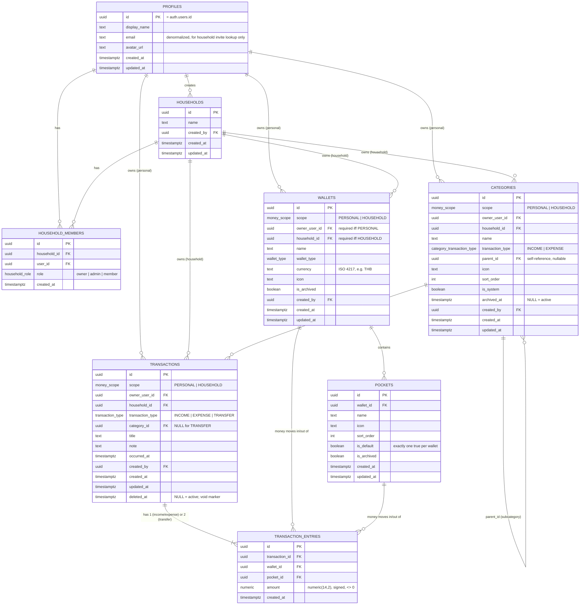

# Database — Our Home (Milestone 1)

Source of truth: `supabase/migrations/*.sql`. This document explains the
schema; it does not replace reading the migrations for exact SQL.

## ER diagram



## Enums

- `money_scope`: `PERSONAL`, `HOUSEHOLD`.
- `household_role`: `owner`, `admin`, `member`.
- `wallet_type`: `BANK`, `CASH`, `CREDIT_CARD`, `E_WALLET`, `OTHER`.
- `transaction_type`: `INCOME`, `EXPENSE`, `TRANSFER` (transactions table).
- `category_transaction_type`: `INCOME`, `EXPENSE` (categories table — a
  category can never be a "transfer" category, so this is a distinct,
  narrower enum rather than reusing `transaction_type`).

## Key constraints (see migrations for exact SQL)

- `wallets`/`categories`/`transactions` all carry the same
  personal-vs-household `CHECK`:
  `(scope = 'PERSONAL' AND owner_user_id IS NOT NULL AND household_id IS NULL)
  OR (scope = 'HOUSEHOLD' AND household_id IS NOT NULL AND owner_user_id IS NULL)`.
- `pockets`: partial unique index `(wallet_id) WHERE is_default` — exactly
  one default pocket per wallet.
- `household_members`: unique `(household_id, user_id)` — a user cannot be a
  member of the same household twice.
- `categories`: trigger-enforced — no self-parenting, no cycles, parent and
  child `transaction_type` must match.
- `transaction_entries.amount`: `CHECK (amount <> 0)` — a zero-amount entry
  is never meaningful.
- `transaction_entries`: trigger-enforced — the referenced `pocket_id` must
  belong to the referenced `wallet_id` (prevents an entry claiming money
  moved in/out of a pocket that isn't part of that wallet).
- `transactions`: `CHECK` — `TRANSFER` rows always have `category_id IS
  NULL`; `INCOME`/`EXPENSE` rows are expected (application-validated, not
  DB-forced) to carry a category.

## Functions

| Function | Security | Purpose |
|---|---|---|
| `handle_new_user()` | DEFINER (trigger on `auth.users`) | Creates the matching `profiles` row on signup. |
| `set_updated_at()` | INVOKER (trigger) | Generic `updated_at = now()` on update, attached to every table that has the column. |
| `create_default_pocket()` | INVOKER (trigger on `wallets`) | Creates the `Main` default pocket when a wallet is inserted. |
| `categories_validate_hierarchy()` | INVOKER (trigger on `categories`) | Rejects self-parenting, cycles, and transaction-type mismatches. |
| `transaction_entries_validate_pocket()` | INVOKER (trigger on `transaction_entries`) | Rejects an entry whose pocket does not belong to its wallet. |
| `is_household_member(household_id)` | DEFINER | RLS helper — avoids recursive RLS on `household_members`. |
| `has_household_role(household_id, roles[])` | DEFINER | RLS helper for role-gated operations. |
| `get_pocket_balance(pocket_id)` | INVOKER | `SUM(transaction_entries.amount)` for one pocket, RLS-respecting. |
| `get_wallet_balance(wallet_id)` | INVOKER | `SUM(transaction_entries.amount)` for one wallet, RLS-respecting. |
| `create_income_expense_transaction(...)` | INVOKER | Atomically inserts a transaction header + its single entry. |
| `create_pocket_transfer(...)` | INVOKER | Atomically inserts a TRANSFER header + two entries in the same wallet. |
| `create_wallet_transfer(...)` | INVOKER | Atomically inserts a TRANSFER header + two entries across two wallets. |
| `add_household_member(household_id, email, role)` | INVOKER | Owner/admin-only; looks up `profiles` by email and inserts a member row. RLS on `household_members` INSERT still enforces the role check — see migration comments. |

All the write RPCs are `SECURITY INVOKER` (the default): they run as the
calling user, so every `INSERT` inside them is still checked by RLS. A
Postgres function body executes inside one transaction, so if any statement
inside is rejected by RLS or a constraint, the entire function's effects are
rolled back — this is what makes "never persist only one side of a transfer"
true without needing a hand-rolled two-phase commit.

## Row Level Security summary

Full policies are in `supabase/migrations/0008_rls_policies.sql`. In short:

- `profiles`: a user can select/update only their own row.
- `households`: selectable by members; updatable by `owner`/`admin`.
- `household_members`: selectable by members of that household; insertable/
  deletable/updatable by `owner`/`admin` of that household only.
- `wallets`, `categories`, `transactions`: selectable/writable per the
  personal/household rule in `DOMAIN_RULES.md §Security`.
- `pockets`: access follows the parent wallet (no separate scope columns).
- `transaction_entries`: access follows the parent transaction.

## Regenerating TypeScript types

`src/types/database.ts` is hand-written to match these migrations because no
live Supabase project is linked in this environment. Once one exists:

```bash
npx supabase gen types typescript --project-id <project-ref> --schema public > src/types/database.ts
```

and remove the "hand-authored" note at the top of that file.
