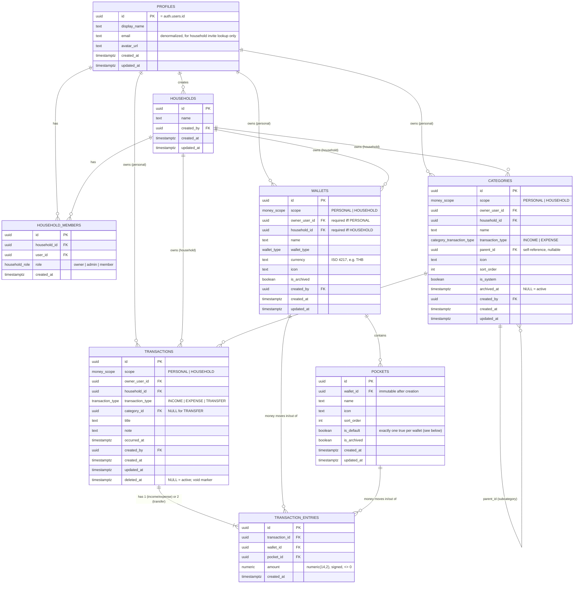

# Database — Our Home (Milestone 1)

Source of truth: `supabase/migrations/*.sql`. This document explains the
schema; it does not replace reading the migrations for exact SQL.

## ER diagram



## Enums

- `money_scope`: `PERSONAL`, `HOUSEHOLD`.
- `household_role`: `owner`, `admin`, `member`.
- `wallet_type`: `BANK`, `CASH`, `CREDIT_CARD`, `E_WALLET`, `OTHER`.
- `transaction_type`: `INCOME`, `EXPENSE`, `TRANSFER` (transactions table).
- `category_transaction_type`: `INCOME`, `EXPENSE` (categories table — a
  category can never be a "transfer" category, so this is a distinct,
  narrower enum rather than reusing `transaction_type`).

## Key constraints (see migrations for exact SQL)

- `wallets`/`categories`/`transactions` all carry the same
  personal-vs-household `CHECK`:
  `(scope = 'PERSONAL' AND owner_user_id IS NOT NULL AND household_id IS NULL)
  OR (scope = 'HOUSEHOLD' AND household_id IS NOT NULL AND owner_user_id IS NULL)`.
- `pockets`: partial unique index `(wallet_id) WHERE is_default` guarantees
  *at most* one default pocket per wallet; a trigger
  (`pockets_protect_default`, added in the hardening migration
  `0017_default_pocket_invariant.sql`) additionally refuses to unset or
  archive the current default, which is what actually makes it *exactly*
  one in practice. There is no "change the default pocket" RPC yet — that
  is future work if it turns out to be needed.
- `household_members`: unique `(household_id, user_id)` — a user cannot be a
  member of the same household twice. A trigger
  (`household_members_protect_owner`, `0016_household_invite_and_owner_integrity.sql`)
  refuses to delete or demote the last `owner` row of a household.
- `categories`: trigger-enforced — no self-parenting, no cycles, parent and
  child `transaction_type` must match, and (added in
  `0018_category_hierarchy_ownership.sql`) parent and child must share the
  same `scope` and `owner_user_id`/`household_id` (and both be `is_system`
  or both not) — a personal category cannot nest under a household one, a
  household category cannot nest under another household's, etc.
- `transaction_entries.amount`: `CHECK (amount <> 0)` — a zero-amount entry
  is never meaningful.
- `transaction_entries`: trigger-enforced — the referenced `pocket_id` must
  belong to the referenced `wallet_id` (0008), and (added in
  `0013_ledger_relationship_validation.sql`) the referenced `wallet_id`
  must be compatible with the parent transaction's scope/owner/household.
- `transactions`: `CHECK` — `TRANSFER` rows always have `category_id IS
  NULL`; `INCOME`/`EXPENSE` rows are expected (application-validated, not
  DB-forced) to carry a category.
- **Identity/scope columns are immutable after creation**
  (`0014_immutable_identity_fields.sql`, extended by
  `0019_category_transaction_type_immutable.sql` and
  `0021_household_created_by_immutable.sql`): `wallets.scope`,
  `.owner_user_id`, `.household_id`, `.created_by`, `.currency`;
  `pockets.wallet_id`; `categories.scope`, `.owner_user_id`,
  `.household_id`, `.created_by`, `.is_system`, `.transaction_type`;
  `households.created_by`. `transactions` has no mutable identity columns
  to protect because direct `UPDATE` on `transactions` is revoked entirely
  (see "Transaction write security" below) — there is currently no
  edit/void UI, so there is nothing legitimate to carve an exception for.
- `create_wallet_transfer` rejects a transfer between wallets with
  different `currency` values — a plain transfer has no exchange-rate
  semantics; cross-currency movement is a future feature, not part of
  Milestone 1.
- **Archived wallets/pockets reject new ledger activity**
  (`0020_reject_archived_wallets_and_pockets.sql`): all three `create_*`
  RPCs check `is_archived` on every wallet and pocket they touch, mirroring
  the existing archived-category check. This is a write-time gate only —
  archiving never modifies or hides existing `transaction_entries` rows or
  the balances derived from them.

## Functions

| Function | Security | Purpose |
|---|---|---|
| `handle_new_user()` | DEFINER (trigger on `auth.users`) | Creates the matching `profiles` row on signup, email lowercased. |
| `handle_user_email_change()` | DEFINER (trigger on `auth.users`) | Keeps `profiles.email` in sync if the user later changes their auth email. |
| `set_updated_at()` | INVOKER (trigger) | Generic `updated_at = now()` on update, attached to every table that has the column. |
| `create_default_pocket()` | INVOKER (trigger on `wallets`) | Creates the `Main` default pocket when a wallet is inserted. |
| `pockets_protect_default()` | INVOKER (trigger on `pockets`) | Refuses to unset or archive the default pocket. |
| `categories_validate_hierarchy()` | INVOKER (trigger on `categories`) | Rejects self-parenting, cycles, transaction-type mismatches, and scope/ownership mismatches with the parent. |
| `transaction_entries_validate_pocket()` | INVOKER (trigger on `transaction_entries`) | Rejects an entry whose pocket does not belong to its wallet. |
| `transaction_entries_validate_wallet_scope()` | INVOKER (trigger on `transaction_entries`) | Rejects an entry whose wallet is incompatible with its parent transaction's scope/owner/household. |
| `prevent_immutable_column_changes()` | INVOKER (trigger, parameterized) | Generic guard used on `wallets`/`pockets`/`categories`/`households` to freeze identity columns after creation. |
| `household_members_protect_owner()` | INVOKER (trigger on `household_members`) | Refuses to delete or demote a household's last `owner`. |
| `is_household_member(household_id)` | DEFINER | RLS helper — avoids recursive RLS on `household_members`. |
| `has_household_role(household_id, roles[])` | DEFINER | RLS helper for role-gated operations. |
| `is_wallet_authorized(wallet_id)` | DEFINER | Authorization check used by every ledger-write RPC below (PERSONAL owner or HOUSEHOLD member). |
| `get_pocket_balance(pocket_id)` | INVOKER | `SUM(transaction_entries.amount)` for one pocket, RLS-respecting. |
| `get_wallet_balance(wallet_id)` | INVOKER | `SUM(transaction_entries.amount)` for one wallet, RLS-respecting. |
| `create_income_expense_transaction(...)` | **DEFINER** | Checks `is_wallet_authorized()` and wallet/pocket/category archived status, then atomically inserts a transaction header + its single entry. |
| `create_pocket_transfer(...)` | **DEFINER** | Checks `is_wallet_authorized()` and wallet/pocket archived status, then atomically inserts a TRANSFER header + two entries in the same wallet. |
| `create_wallet_transfer(...)` | **DEFINER** | Checks `is_wallet_authorized()`, archived status, and currency match for both wallets/pockets, then atomically inserts a TRANSFER header + two entries across two wallets. |
| `add_household_member(household_id, email, role)` | **DEFINER** | Explicitly checks the caller is owner/admin, enforces the invite-role rules (see `DOMAIN_RULES.md §Security`), looks up `profiles` by email with RLS bypassed on purpose, and inserts the membership row. |

### Transaction write security

`transactions` and `transaction_entries` grant `SELECT` only to
`authenticated` — `INSERT` is revoked from both, and `UPDATE` on
`transactions` is revoked entirely (migration
`0012_lockdown_transaction_writes.sql`). The only way to write the ledger
is through the three `create_*` RPCs above. This is deliberate: TypeScript
types and Server Action validation are not a security boundary, since a
client can call PostgREST directly with its own access token, bypassing
the Next.js app entirely. Locking the tables down at the grant level closes
that regardless of what the frontend does or doesn't check.

The three `create_*` RPCs (and `add_household_member`) are `SECURITY
DEFINER`, not `SECURITY INVOKER` like earlier in Milestone 1 — see
`ARCHITECTURE.md §3` for why that flip was necessary once direct table
writes were revoked, and how each function replaces RLS with an explicit,
hand-written authorization check instead.

## Row Level Security summary

Full policies are in `supabase/migrations/0009_rls_money.sql` (wallets,
pockets, categories, transactions, transaction_entries) and
`0002_profiles.sql` / `0004_household_members.sql` (profiles, households,
household_members), as amended by the hardening migrations `0012`–`0018`.
In short:

- `profiles`: a user can select their own row, or a fellow household
  member's; can update only `display_name`/`avatar_url` on their own row
  (column-level grant — `email` is not client-writable at all).
- `households`: selectable by members; updatable by `owner`/`admin`.
- `household_members`: selectable by members of that household.
  Insert/update/delete are revoked from `authenticated` entirely — the
  only way to add a member is `add_household_member()` (see above); there
  is no way to change a role or remove a member yet (Milestone 1 has no UI
  for either, so nothing is left open "just in case").
- `wallets`, `categories`: selectable/writable by any active member for
  `HOUSEHOLD` scope, or the owner for `PERSONAL` scope — see
  `DOMAIN_RULES.md §Security` for why this is intentionally broader than
  the owner/admin gate on household structure itself. Identity/scope
  columns are frozen after creation regardless (see "Key constraints").
- `transactions`, `transaction_entries`: `SELECT` only; all writes go
  through the RPCs (see "Transaction write security").
- `pockets`: access follows the parent wallet (no separate scope columns);
  the default pocket cannot be unset/archived.

## Regenerating TypeScript types

`src/types/database.ts` is hand-written to match these migrations because no
live Supabase project is linked in this environment. Once one exists:

```bash
npx supabase gen types typescript --project-id <project-ref> --schema public > src/types/database.ts
```

and remove the "hand-authored" note at the top of that file.
